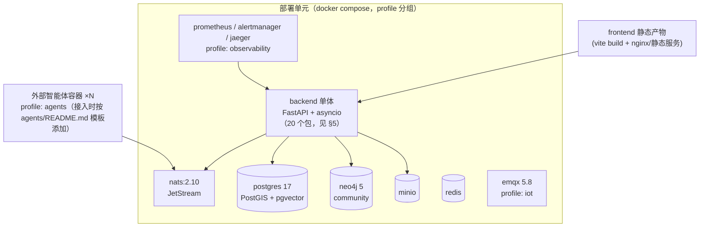
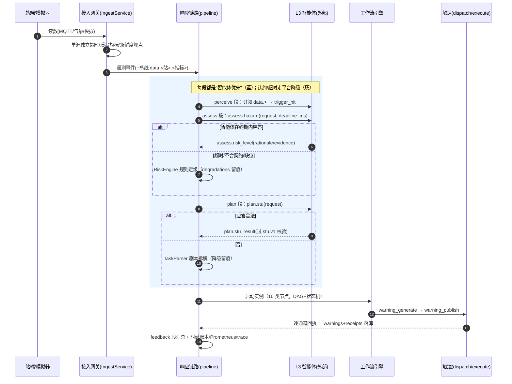
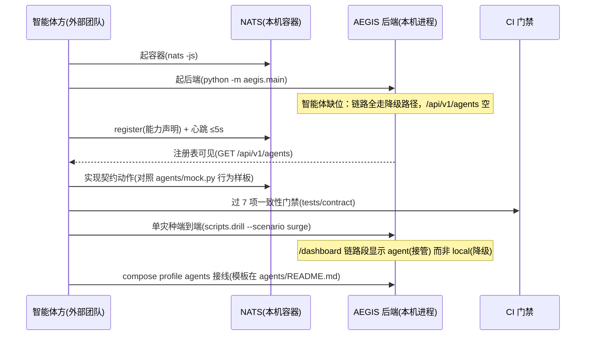

# 课题6：西藏山地灾害多智能体协同调控技术与平台研究 — 架构设计方案

> 版本：v3.3（多视图版）
> 适配环境：高原复杂环境 + 弱网场景
> 覆盖灾种：滑坡、崩塌危岩、泥石流、冰雪雪崩、冰湖溃决（≥5 类）
> 理论框架：MA-RIAEW（多智能体协同赋能的突发事件风险情报感知及预警模式，刘逸伦等，2025）
> 实现基线：`aegis` 仓库（平台侧 M1–M3 已建成；实现态清单见 `docs/architecture.md`，实测证据见 `docs/REPORT.md`）

---

## 〇、怎么读这份架构（视图索引）

单一 张分层图说清楚架构是不可能的——它必然把逻辑、进程、代码、部署混在一起。v3.0 按**多视图**组织，每个视图只回答一个问题：

| 视图 | 章节 | 回答的问题 |
| --- | --- | --- |
| 语境视图 | §2 | 系统边界在哪，和谁交互 |
| 逻辑分层视图 | §3 | 能力怎么分层，**依赖方向是什么** |
| 进程与部署视图 | §4 | 进程怎么切，为什么是模块化单体 |
| 组件视图 + 架构铁律 | §5 | 20 个代码包怎么分组，**七条不可违反的规则**（有 CI 守卫） |
| 场景视图 | §6 | 一次灾害事件 / 一次人工上报 / 一次智能体接入，实际怎么走 |
| 数据视图 | §7 | 数据归谁所有，一致性语义是什么 |
| 质量属性 | §8 | 每个质量指标靠什么战术达成、证据在哪 |
| 理论映射 | §9 | MA-RIAEW 四子系统 ↔ 平台组件 |
| 指标映射 | §10 | 考核指标 → 支撑模块 → 状态 |
| 演进视图 | §11 | 还差什么、按什么顺序补 |

**术语表**（本文档与代码同名同义）：

| 术语 | 含义 |
| --- | --- |
| 腿（leg） | 一个可选子系统（如 postgres 持久腿、graphiti 知识腿），三态外显：未启用 / 启用 / 启用但降级 |
| 内核 | 不可降级、必须常在的最小集合：总线、链路、服务、工作流、内存存储（§5 三环模型） |
| 装配点 | `container.py` + `integrations.py`，全仓库唯一构造可选腿 I/O 实现的地方 |
| 降级 | 智能体/腿缺位或违约时，链路改走平台规则路径，且在 `degradations` 与状态面留痕 |
| STU | 标准化任务单元（`contracts/stu.v1.schema.json`），任务拆解的统一产物 |
| 门禁 | CI 里防回潮的测试（契约一致性、节点分派矩阵、依赖铁律等） |
| 取证 | 可复跑的命令 + 输出数字，收录在 `docs/REPORT.md` |

---

## 一、架构目标与约束

### 1.1 质量属性需求（从考核指标导出，按优先级排序）

| 优先级 | 质量属性 | 需求 | 来源 |
| --- | --- | --- | --- |
| P0 | 可降级性 | 任何智能体/外部设施缺位，链路语义不变只变路径 | 指标 3 协同语义、高原现实 |
| P0 | 时延 | 调度 ≤2s / 重调度 ≤10s / 同步 ≤3s / 接入 ≤5min / 预警 ≤3min / 触达 ≤20min | 指标 2/3/4 |
| P0 | 可验证性 | 每个验收数字可复跑取证，未测到的如实标注 | 项目验收方式 |
| P1 | 弱网韧性 | 断网自治、按序重放、单源故障隔离 | 高原场景约束 |
| P1 | 可扩展性 | 灾种 / 节点类型 / 通道 / 智能体四类扩展不改内核 | 指标 1/2、外部团队接入 |
| P1 | 安全性 | 凭据不出状态面、外呼白名单、URL 脱敏 | 部署形态要求 |
| P2 | 可观测性 | 全链路 trace、时延账本、SLA 告警 | 验收与运维 |
| P2 | 容量 | ≤120 并发"读+演练"混合负载达阈（本机口径） | 实测基线 |

### 1.2 硬约束

- 应用形态：**纯 Web 平台**（响应式，无原生移动端）
- 团队分工：**L3 五大智能体由外部团队实现**（交付落点 `agents/`），本仓库承载其余全部
- 推理环境：CPU-only（int8 量化模型，预算制检索）
- 部署环境：可离线部署（底图/地形/权重全部自托管，零 Ion/谷歌依赖）

---

## 二、视图一：系统语境（System Context）

```mermaid
flowchart LR
    OP["指挥员 / 值班员<br/>(Web 浏览器)"]
    FIELD["群防群治上报者<br/>(Web 表单 ★)"]
    STATION["监测站端 / 气象源<br/>(MQTT 推送 / HTTP 拉取)"]
    AGTEAM["智能体方(外部团队)<br/>感知/研判/决策/执行/反馈 五智能体"]
    CHANNEL["触达通道<br/>短信网关 / 应急广播"]

    AEGIS["AEGIS 平台<br/>(模块化单体 + Web 前端)"]

    OP -- "HTTPS / SSE" --> AEGIS
    FIELD -- "HTTPS (POST /reports ★)" --> AEGIS
    STATION -- "MQTT / HTTP" --> AEGIS
    AGTEAM <--) "NATS JetStream<br/>AgentMessage v1" --> AEGIS
    AEGIS -- "HTTP + 回执" --> CHANNEL
```

（★ 原本标"计划中尚未实现"，v3.1 起逐项改判——**已交付**：★语义交互服务、★智能助手页、
★人工上报、★预警规则库、★三路融合解析、★HTTP 触达通道；v3.2 补上最后半个 ★——场景二的
"低置信度转人工核签"：上报侧除 `human_review_required` 与计数外，低置信度会自动开出一张
`human_review` 工单（`REPORT_REVIEW_TEMPLATE`，approve/adjust/reject 三态 + 三分支通知），
指挥员不再需要手动起实例。**★ 标记保留原位不动**（分层图内是等宽 ASCII 画框，改字形会破框），
以本段与 §9–§11 的状态为准。）

**边界断言**：跨进程交互只有两类——**总线消息**（智能体 ⇋ 平台，契约校验）与**平台只读数据 API**（智能体取数，服务令牌）。智能体不 import 平台代码、不直连数据库（`contracts/` 边界三原则，门禁强制）。

---

## 三、视图二：逻辑分层与依赖方向（五层 + 一基座）

"五层 + 一基座"是对外汇报的**能力分层**；本节同时给出它隐含的**依赖方向规则**——这是分层架构质量的判据，比层名更重要。

```
┌──────────────────────────────────────────────────────────────────────────────┐
│ L5 应用层（纯 Web，响应式）                                                   │
│   态势大屏 │ 一张图 │ 监测预警 │ 预警发布 │ 流程编排 │ 指标量测 │ ★智能助手   │
├──────────────────────────────────────────────────────────────────────────────┤
│ L4 服务层（本仓库）                                                           │
│   任务智能解析(规则+检索+LLM三路) │ 柔性工作流引擎 │ 协同调度 │ 预警生成      │
│   靶向触达(短信/广播HTTP通道+回执) │ ★语义交互服务 │ 准确率回放/阈值标定闭环  │
├──────────────────────────────────────────────────────────────────────────────┤
│ L3 智能层（外部交付：五大智能体由智能体方实现，落点 agents/<type>/）           │
│   感知智能体 → 研判智能体 → 决策智能体 → 执行智能体 → 反馈智能体               │
├──────────────────────────────────────────────────────────────────────────────┤
│ L2 数据层                                                                     │
│   时序遥测(PG+PostGIS) │ 对象存储(MinIO) │ 灾情图谱(Neo4j+Graphiti)           │
│   历史案例库 │ 混合检索(pgvector+BM25+RRF) │ 工作流定义库 │ ★预警规则库       │
├──────────────────────────────────────────────────────────────────────────────┤
│ L1 感知接入层                                                                 │
│   雨量/水位/泥位 │ 位移/GNSS │ 视频监控 │ MQTT 推送 │ 气象拉取 │ ★人工上报    │
├──────────────────────────────────────────────────────────────────────────────┤
│ 基座（对所有人提供服务，不依赖任何层）                                         │
│   NATS 总线+契约网关 │ 边缘弱网链路(Zenoh) │ 可观测(OTel/Prom/告警) │ 安全 │
└──────────────────────────────────────────────────────────────────────────────┘
```

### 依赖方向规则（分层质量的硬判据）

| 规则 | 表述 | 违例后果 |
| --- | --- | --- |
| D1 单向依赖 | L5→L4→L2（读）；L4/L3/L1→基座。**禁止反向**：L2 不知道 L4，基座不知道任何层 | 反向依赖会把可选腿变成必选，破坏可降级性 |
| D2 L3 不在依赖链上 | 智能体与平台无代码依赖，唯一通道是基座总线（AgentMessage） | 出现代码依赖则外部团队被平台发版绑架 |
| D3 跨进程仅两处 | 总线消息 + 平台只读数据 API | 多一个口子就多一个契约要冻结 |

### 每层的"准入判据"（什么代码放哪层）

| 层 | 准入判据 | 反例（不属于这层） |
| --- | --- | --- |
| L1 | 只做"协议→平台事件"的翻译，不做业务判断 | 在连接器里定级 |
| L2 | 只存取，不决策；Schema 变更走幂等迁移 | 在存储层算风险等级 |
| L3 | 外部进程，按契约动作收发消息 | 智能体直连数据库 |
| L4 | 业务编排与领域逻辑；一切"怎么做"的判断 | 在 API 层做算术（HTTP 出口不算数，判定单点在 `persistence/replay.py`） |
| L5 | 展示与交互；过滤走后端参数，不前端假过滤 | 前端拼装业务结论 |
| 基座 | 与业务无关的通道与设施 | 总线里出现灾种枚举 |

---

## 四、视图三：进程与部署（模块化单体是刻意决策）

### 4.1 进程拓扑（C4 容器级）



### 4.2 为什么是模块化单体（而不是微服务）——架构决策记录

| 理由 | 说明 |
| --- | --- |
| 弱网与边缘 | 二级边缘节点单机部署，多服务编排是负担；单进程 + 外部基础设施容器已可水平复制 |
| 团队规模 | 平台侧小团队；模块边界用**包依赖铁律**（§5）守卫，而不是用进程边界守卫 |
| 降级语义 | 进程内降级（规则路径接管）是函数调用级切换，微服务间降级还要考虑注册中心自身的可用性 |
| 唯一真边界 | 需要进程隔离的只有智能体（外部团队、语言不限）——用总线契约隔离，恰好与团队边界重合 |

**推论**：单体的"微服务性"体现在三处——包依赖铁律（编译期）、总线契约（运行期）、compose profile（部署期）。扩展为多实例时，无状态部分（API/链路）直接复制，状态全部在外部容器。

### 4.3 三级部署（高原弱网）

```
一级：拉萨/日喀则中心节点（主+备）——全量存储/图谱/大屏/助手
二级：地市/区县边缘节点——区域汇聚/离线工作流/边缘缓存（Zenoh 有界缓冲+按序重放）
三级：现场感知/执行节点——监测站/视频前端/应急广播/群防群治终端(上报)
```

弱网保障：断网自治（边缘本地闭环）、增量压缩、可靠重传（序号+ACK）、数据分层（报警优先）；链路切换（光纤/4G-5G/北斗短报文备用）**未实现**——平台侧只有 Zenoh 站端↔网关一段与 MQTT/气象两条接入腿，"按链路质量自动切换"要的是多运营商出口与空口实测，本机给不出这个条件（已记 REPORT 诚实清单第 16 项）。链路取舍：灾害总线 NATS JetStream（中心侧），站端↔网关 Zenoh（弱网段，POC 已实测互通与按序重放）。

---

## 五、视图四：组件分组与架构铁律

### 5.1 三环模型（backend/src/aegis 的 20 个包）

```
┌─────────────────────────────────────────────────────────────────────┐
│ 出口与装配环                                                         │
│   api（HTTP/SSE 出口）│ container + integrations（唯一装配点）        │
│   observability │ agents（Mock 参考实现，非产品）                     │
│ ┌─────────────────────────────────────────────────────────────────┐ │
│ │ 内核环（不可降级、必须常在）                                       │ │
│ │   domain（枚举/契约镜像，零依赖）│ config │ errors │ logging      │ │
│ │   bus（总线/网关/注册）│ pipeline（五段链路）│ services            │ │
│ │   workflow（DAG 引擎）│ storage（内存读视图）                     │ │
│ │ ┌─────────────────────────────────────────────────────────────┐ │ │
│ │ │ 可选腿环（可缺/可降级/三态外显；I/O 只在装配点构造）           │ │ │
│ │ │   persistence(PG) │ analytics(CH+DuckDB) │ knowledge(Graphiti)│ │ │
│ │ │   retrieval(混合检索) │ connectors(mqtt/weather) │ edge(Zenoh)│ │ │
│ │ └─────────────────────────────────────────────────────────────┘ │ │
│ └─────────────────────────────────────────────────────────────────┘ │
└─────────────────────────────────────────────────────────────────────┘
```

| 环 | 包 | 与其他环的关系 |
| --- | --- | --- |
| 内核环 | `domain` `config` `errors` `logging` `bus` `pipeline` `services` `workflow` `storage` | **不 import 可选腿的 I/O 实现**；对腿的能力经 Protocol 注入（如 `KnowledgeProvider`） |
| 可选腿环 | `persistence` `analytics` `knowledge` `retrieval` `connectors` `edge` | 被装配点构造后注入内核；腿内纯计算模块（协议、算式）可被内核/出口引用 |
| 出口与装配环 | `api` `observability` `container` `integrations` `agents` | `api` 只做出口翻译；`container`+`integrations` 是全仓库唯一构造腿 I/O 的地方 |

**包 → 逻辑层映射**（汇报口径 ↔ 代码口径一一对应）：

| 逻辑层 | 代码包 |
| --- | --- |
| L1 感知接入 | `connectors`（模拟/MQTT/气象）+ `edge`（Zenoh）+ ★人工上报（落 `api`+`services`） |
| L2 数据 | `storage`（读视图）`persistence` `analytics` `knowledge` `retrieval` |
| L3 智能层 | `contracts/`（仓库根）+ `agents/`（仓库根，交付落点）+ `agents/mock.py`（参考） |
| L4 服务 | `pipeline` `services` `workflow` |
| L5 应用 | `frontend/src`（六页 + ★助手页） |
| 基座 | `bus` `observability` `config` `errors` `logging` `domain` |
| （横切） | `api` `container` `integrations` |

### 5.2 七条架构铁律（每条有守卫，不是愿景）

| # | 铁律 | 理由 | 守卫（现状） |
| --- | --- | --- | --- |
| 1 | **契约先行**：跨边界唯一载体 AgentMessage v1；STU 逐条过 schema | 外部团队可独立开发；破坏性变更可控 | 网关 Draft202012 100% 校验 + `tests/contract/`（7 项门禁） |
| 2 | **智能体优先、平台降级**：每段链路双路径，降级必须留痕（`degradations`），"装配时跳过"与"运行后降级"是两行不同事实 | 可降级性 P0 | e2e 三形态测试 + `/api/v1/integrations` 三态面 |
| 3 | **内核不依赖可选腿的 I/O**：能力经 Protocol 注入；腿的构建函数只从 `container.py`/`integrations.py`（及 scripts 运维入口）调用 | 腿可拔可换，降级才可能 | **`tests/unit/test_architecture_rules.py`（v3.0 新增，AST 级）** |
| 4 | **domain 是唯一真源**：枚举/契约镜像零依赖，其他包不得复制口径 | 两份口径必然漂移 | 同上（domain 零依赖断言）+ 前端 `repoSource.ts` 现场解析后端源 |
| 5 | **热路径不等慢腿**：OLAP write-behind、检索预算制（5000ms）、SSE 丢旧保活、单源独立超时、图谱写路径不进链路 | 时延 P0 | `tests/perf/` + `load_policy` + REPORT 实测 |
| 6 | **凭据不出状态面**：DSN/端点脱敏为 `scheme://host[:port]/path`；外呼白名单主机粒度；URL 内嵌凭据拒绝 | 安全 P1 | 状态面用例 + outbound 闸测试（拒发计数外显） |
| 7 | **指标必须实测、降级必须可见**：验收数字可追溯到样本；未测到的写 `not_measured`；mock 通道的数字不得冒充真触达 | 可验证性 P0 | `latency_report()` + CI 指标冒烟 + REPORT 取证链 |

> 铁律 3/4 原先只存在于注释与 ADR 叙述中，v3.0 起由 `test_architecture_rules.py` 在 CI 强制——**架构规则必须和代码一起过测试，否则就是文档装饰**。

---

## 六、视图五：关键场景（怎么走）

### 6.1 场景一：一次监测事件的全链路（双路径）



实测口径：调度 P50 0.055ms（≤2s）、重调度 P95 36.5ms（≤10s）、协同成功率与同步时延样本在网关事务台账（智能体接入前为 Mock 样本，如实标注）。

### 6.2 场景二：人工上报（✅ v3.1 已交付，v3.2 补齐末段核签）

```
群防群治(Web 表单/助手页) → POST /api/v1/reports(ReportIn)
  → 任务智能解析（文本→实体/灾种/等级抽取：规则+检索+LLM 三路）
  → 结构化事件进链路（与场景一同一条链路）
  → 回执给上报人；低置信度转人工核签（human_review 节点）
```

末段的实现态（v3.2）：置信低于 `report_review_confidence` 时，`PlatformContainer._open_report_review()`
用 `REPORT_REVIEW_TEMPLATE` 自动起一个实例并停在 `human_review` 节点，回执里带回
`review{workflow_id, instance_id, pending_node, options, decision_endpoint}`——三态
（approve/adjust/reject）经**既有**工作流决策接口签核，不新增一套平行的签字口径。三条边界照实记下：

- **开单不拦发布**：预警照发。漏报的代价高于误报，判定过程已在 `degradations` 里逐条留痕，
  工单判的是"这条结论是否按现状生效"，不是"要不要报"；
- **工单不重复发预警**：模板里刻意不放 `warning_publish` 节点，否则一次核签把触达数字翻倍，
  `delivery` 状态面的计数就再也不能信；
- **开单在时延量测点之后**：`report_intake_seconds` 判的是"上报→链路完成"（≤5min 那档），
  把等人签字的时间算进去等于用人的节奏污染机器的口径。

流程未注册（定义缺失或非 active）时返回 `review=None` 并写告警日志，`human_review_required`
仍在——降级是一条可见事实，不是一个空对象。

### 6.3 场景三：外部智能体接入联调（对方团队视角）



---

## 七、数据视图

### 7.1 存储矩阵与所有权

| 存储 | 写者 | 读者 | 一致性语义 |
| --- | --- | --- | --- |
| 内存读视图（`storage/`） | 各服务直写 | API 热读 | 会话级（进程重启即失，真源在腿） |
| PostgreSQL（11 表：站点/遥测/STU/预警/回执/链路/工作流×3/真值标注/规则库） | WriteBuffer 异步批量（有界+重放去重） | API / 回放 / geo 查询 | 最终一致；库不可达时读视图照常服务、写侧缓冲重试并计数 |
| Neo4j + Graphiti | `learn_case`（写路径用 LLM，4–7 次调用，**不进链路热路径**） | `recall`（读路径无 LLM，读实例注入"一调用即抛错"守卫） | 最终一致；缺凭据/缺图时降级内存案例库并外显 |
| 混合检索索引（pgvector + BM25） | 建索引路径（文档侧嵌入 ~3.8s/5 条，离线路径） | 查询路径（单查询嵌入 26.5ms + 重排预算内） | 可重建；权重缺失降级 HashingEmbedder 且**分数不进准确率汇报** |
| ClickHouse / DuckDB | write-behind（热路径不等 OLAP） | 分析/边缘空间分析 | 分钟级延迟可接受 |
| MinIO / Redis | 计划中（对象归档/缓存） | — | compose 已备 |

### 7.2 时空基准与治理

- 坐标 CGCS2000/WGS84（PostGIS geography 4326）；区划网格编码（西藏行政区划码）；
  **时间：线上与存储一律 UTC 毫秒 ISO（`domain/messages.py: now_iso()`，带 `Z`），界面固定换算成 UTC+8 显示并标注**
  （`frontend/src/utils/clock.ts`）。不跟随浏览器时区——同一条预警在不同机器上显示成两个时刻，
  而"这条预警什么时候发的"必须只有一个答案；也不在界面显示裸 UTC ISO，值班指挥员读的是墙上时钟，
  差八小时在应急场景里不是排版问题
- **时延的单位与时钟**：账本里每条指标的值按指标名后缀取单位（`*_ms` 毫秒、`*_seconds` 秒），
  出口 JSON 用**中性键名**（`p50/p95/budget`）加一个 `unit` 字段把单位说出来——键名不声称单位，
  单位由账本自己声明。此前所有指标都塞进 `p50_ms/budget_ms`，于是秒制那两条的 0.019（秒）
  被键名说成毫秒，前端、`metrics_report.py` 与助手的 `query.metrics` 三处各自"按后缀猜"，
  而 Prometheus 的毫秒直方图 `aegis_latency_ms` 更是在直接吃秒值（差 1000 倍，且不会有任何东西变红）。
  指标名不改：`deploy/observability/alerts.yml` 等处按名字引用，改名会打断告警与历史序列。
  **毫秒级测量一律用 `perf_counter`**：`time.monotonic()` 在 Windows 上是 `GetTickCount64()`，
  步进 15.6 ms，用它量一轮 0.3 ms 的语义交互得到的是恒为 0 的读数——"≤3s"就此成了永绿项
  （源码门禁与真机前后数字见 REPORT"夜间浏览器深巡实测"）
- 血缘（预警→读数→站点可追溯，`/api/v1/geo/hazard-trace`）；质量旗标（`quality_flag`，劣化读数不参与判定、界面按缺口显示）
- **数据分级（公开/内部/敏感/机密）未实现**，如实记在这里而不是打勾：平台侧 HTTP API 目前**没有鉴权模型**
  （部署假设是专网/内网），没有调用方身份就没有"按密级裁剪"的落点；先造一个四级枚举摆在那里，
  得到的只是"看起来分了级"。落地前置条件写在 REPORT 诚实清单第 17 项（谁调、带什么凭据、哪些字段算敏感）。
  眼下唯一的真实防线是**脱敏**：凭据只进请求头、外呼目标只报 `scheme://host`、案例出处逐条外显（§8 安全行）
- **不编造**：站点坐标缺失返回 null（列入"未定位"）；案例库出处逐条外显；`observed_at` 落在未来即拒

---

## 八、质量属性战术表

| 属性 | 战术 | 实现位置 | 证据（REPORT） |
| --- | --- | --- | --- |
| 时延 | 全 asyncio + gather 并发；orjson；uvloop（非 Windows）；检索预算制（5000ms+rerank top5 配套）；SSE 丢旧 | `pipeline/` `bus/transport.py` `retrieval/` | 调度 P50 0.055ms；链路含检索 4.3–4.5s（占 ≤3min 的 2.4%）；**部署形态（容器整栈）合账 2026-10-03**：预警生成 P50 1.677ms、上报腿 P50 0.661s、语义交互 P50 0.154ms，越限 0 |
| 可用/可降级 | 九条腿三态；双传输（NATS/内存）；写缓冲；规则引擎兜底每段链路 | `integrations.py` `pipeline/chain.py` | `/readyz` 200 ≠ 接上了（DNS 坑取证）；降级事实逐腿外显 |
| 弱网 | Zenoh 有界缓冲+按序重放+重放前可查；TTL 防过期指令；msg_id 幂等重投安全 | `edge/` `bus/gateway.py` | Zenoh 44+4 项用例；丢包梯度为本机合成（如实标注） |
| 容量 | 单 worker ≤120 并发达阈（读+演练混合） | `observability/load_policy.py` | 拐点 120→200，部署形态同形状 |
| 安全 | 凭据脱敏；外呼白名单（http/https、主机精确匹配、拒内嵌凭据、不跟随重定向）；检索参数绑定防注入；测试注入客户端 | `workflow/outbound.py` `integrations.py` | 拒发计数外显；seekdb 恶意 doc_id 用例 |
| 可观测 | OTel→Jaeger（真实链路 6 跨度可找回）；时延账本分位数；Prometheus 9 条 SLA 规则+抑制 | `observability/` `deploy/observability/` | promtool/amtool 全过；critical→duty-escalation 路由实测 |
| 可扩展 | 灾种=枚举+规则表；节点=NodeSpec 注册表（16 类，分派矩阵测试）；通道=适配器；智能体=总线契约 | `domain/enums.py` `workflow/nodes.py` `services/delivery.py` | 跨端漂移门禁（前端解析后端真源） |
| 可验证 | 全部门禁化：ruff/mypy/pytest 四绿 + **4 个 CI job**（`gate`（含契约/分派矩阵/依赖铁律三套守卫，同一条 `pytest -q --maxfail=1`）/ `frontend` / `deploy-artifacts` / `integration-nats`） | `.github/workflows/ci.yml` | 2503 后端 + 492 前端测试项（门禁规模以 `docs/REPORT.md` 那行为准，改代码后要重测） |

---

## 九、MA-RIAEW 理论映射（指导论文 → 本平台）

| MA-RIAEW 子系统 | 论文职责 | 本平台组件 | 状态 |
| --- | --- | --- | --- |
| 大语言模型（LLM） | 认知中枢：NLU、任务分解规划（CoT/ToT）、知识融合、工具调用 | `services/llm_gateway.py`（OpenAI 兼容）+ 各服务提示工程 | 网关已实现；用途由 v3.x 从"翻译润色"扩展到"解析/助手/复盘" |
| 智能体管理中心 | 智能体集群、交互通信、记忆、组织 | `bus/`（网关+注册+心跳摘除）+ `agents/`（外部交付落点）+ `agents/mock.py`（参考实现）+ Graphiti（长期记忆）+ 检索（语义记忆） | 支撑设施已实现并真 NATS 实测；本体等外部接入 |
| 工具与应用中心 | 标准化工具接入、工具编排与工作流 | `workflow/`（16 类节点 + outbound 白名单外呼）+ connectors + geo/retrieval 只读能力 | 已实现 |
| **用户交互中心** | 意图解构、认知镜像、动态增强回路 | `services/assistant.py`（白名单四类任务 + 人工确认）+ `api/assistant_api.py`（SSE）+ `views/AssistantView.vue`；反馈经 `services/calibration.py` 的阈值标定闭环；低置信度上报自动开 `human_review` 工单（`REPORT_REVIEW_TEMPLATE`） | ✅ 已交付（v3.1，核签工单 v3.2）：意图解构=规则词表优先 + LLM 兜底且只能选白名单动作；认知镜像复用 `rationale`/`degradations`/通道回执，LLM 只改措辞且编数即弃；增强回路的建议恒 `applied=false` |

四维赋能路径（应急数据管理 / 风险感知识别 / 态势推演 / 预警与反馈）的落点映射维持 v2.1 口径，不赘述。

---

## 十、考核指标 → 支撑模块 → 状态

| 考核指标 | 支撑模块 | 状态 |
| --- | --- | --- |
| 1. ≥5 类触发条件识别 + 智能解析拆解 | 规则引擎（9 规则 / 5 灾种 / 9 类触发条件，`GET /api/v1/rules` 外显）+ ★→✅ 三路融合解析（`services/semantic_parser.py`）+ ★→✅ 阈值标定闭环（`services/calibration.py`）+ 规则库版本化（ADR-0006） | ✅ 代码与取证就位：解析评测集 33 例可复跑（`scripts/eval_report_parsing`）；分规则误报精度待 E1 现场真值 |
| 2. 工作流 ≥10 类节点、≤2s、≤10s | 自研 DAG 引擎（16 类）+ Vue Flow 画布 + ★→✅ 5 灾种内置模板 + ★→✅ 案例驱动推演节点 | **已达标（实测）**，模板覆盖 5/5 |
| 3. 语义交互/数据共享/联动协同、≤3s、≥90% | 契约总线+网关量测（已建成）+ `agents/` 接入门禁 + ★→✅ 语义交互子系统（助手四类任务 + 人工确认） | 总线达标；语义交互已交付（`assistant_reply_ms` 已登记 ≤3s 预算；本机无 LLM 口径实测 5 轮、**P50 0.739ms / P95 2.202ms**，占预算 0.07%——此前这里记的"P50 0.0ms"不是快，是 `time.monotonic()` 在本机步进 15.6 ms 把毫秒级测量量成了 0，见 §7.2 与 REPORT 深巡表；带 LLM 凭据那一档仍待现场）；真样本待外部接入 |
| 4. 接入 ≤5min、生成 ≤3min、触达 ≤20min、准确率 ≥80% | 三条接入腿 + ★→✅ 人工上报（第四条腿，`report_intake_seconds` P50 1.225s；低置信度自动开 ★→✅ 人工核签工单，v3.2）；预警链；★→✅ HTTP 触达通道（真实网关凭据待现场）；回放标定 | 时延达标（**宿主进程与容器整栈两档都量过**，2026-10-03 补上后者）；触达通道已接线但现场数字未测得；准确率仍 `not_measured`（E1 数据侧） |
| 5. 专利/软著/论文/学生/报告 | 素材：三路融合解析、契约化降级协同、实测取证文化 | 批次 E |

---

## 十一、架构演进（批次与依赖）

| 批次 | 内容 | 出口判据 | 状态 |
| --- | --- | --- | --- |
| M1–M3 | 契约/总线/链路降级、持久化/工作流/检索/知识、可观测/一张图/部署 | REPORT 实测记录 | ✅ |
| A | 智能体接入脚手架（`agents/` 五落点+门禁+部署模板） | 外部团队可自助开工 | ✅ |
| A+ | **架构铁律守卫测试**（本文档 §5.2 铁律 3/4 的 CI 化） | `test_architecture_rules.py` 全绿并入 CI | ✅（随 v3.0） |
| B | 语义交互服务+助手页+人工上报端点 | 助手四类任务 e2e；`/reports` 进链路 | ✅（2026-10-03） |
| C | 三路融合解析+预警规则库+标定闭环 | 文本→STU 端到端；阈值版本化 | ✅ 代码侧（2026-10-03）；分规则精度待 E1 真值 |
| D | HTTP 触达+5 灾种模板+推演增强 | 真通道回执；模板 5/5 | ✅ D1–D4（D4 部署形态合账 2026-10-03 已量，并收出 `warning_generation_ms` 恒 0 的假判定） |
| 外部接入 | 五智能体过门禁→compose 接线→真样本 | 门禁全绿；指标 3 真样本进 REPORT | 依赖对方 |
| E | 数据侧+成果侧 | 准确率 `measured`；成果闭环 | 待做 |

任务分解与验收口径见《[课题6_完善计划](课题6_完善计划.md)》。

---

## 附：修订记录

| 版本 | 日期 | 摘要 |
| --- | --- | --- |
| v1.0 | 2026-09 | 初版：五层+一基座，L3 划外部智能体方 |
| v2.0 | 2026-10-03 | 提出 L3 内建化；语义交互子系统；三路融合解析；人工上报与 HTTP 触达；MA-RIAEW 映射 |
| v2.1 | 2026-10-03 | 按分工决策回退内建化：智能体外部交付，建 `agents/` 脚手架；平台侧计划保留 |
| v3.0 | 2026-10-03 | **多视图重写**：语境/分层+依赖方向/进程部署（模块化单体论证）/组件三环模型+七条架构铁律（新增 AST 级守卫测试 `test_architecture_rules.py`）/三个关键场景时序/数据所有权与一致性语义/质量属性战术表。铁律 3/4 由文档叙述升级为 CI 强制 |
| v3.1 | 2026-10-03 | 批次 B/C/D1-D3 落地后按实测改判：语义交互（`services/assistant.py` + SSE + 助手页）、人工上报第四条腿（`POST /api/v1/reports`，与遥测同一条链路、新增 `report_intake_seconds` 预算）、三路融合解析（阈值仍是唯一判据）、预警规则库版本化（ADR-0006 + `trigger_rules` 表 + 标定闭环）、真实 HTTP 触达通道（主机白名单闸 + 状态面第 9 条腿 `delivery`）、5 灾种模板与案例驱动推演。§9/§10/§11 与 ★ 图例同步改判；D4 与 E 批次保持待办 |
| v3.3 | 2026-10-03 | 批次 D4 收口：Docker Desktop 修好后在容器整栈（真 JetStream + 真 PostGIS/pgvector + 现建后端镜像 + 1.1GB int8 权重挂 `/models`）量到端到端合账——预警生成 P50 1.677ms、上报腿 P50 0.661s、语义交互 P50 0.154ms、越限 0，`store.driver=postgres` 不再降级、`retrieval.driver=bge-m3-int8`。**这一档收出一条永远绿的假判定**：`warning_generation_ms` 旧算法是"拿同一次调用里刚盖的 `generated_at` 去减现在"，恒为 0.0ms，即"≤3min 达标"此前从未被量过；改为按链路起点量（`WarningDraft.generation_seconds` 从"事后反推的 property"变成"随结果带出的实测数"），配三条用例并做变异实测（改回旧口径即红）。另把 live 总线用例与运行中部署共用契约主题（NATS 10065）从 fail 改判为带前提的 skip。§8 时延行与 §10 指标 4 同步；环境根因（vhdx 属主导致 HCS 补不进本次会话的 VM ACE）记在 REPORT 诚实清单第 13 项 |
| v3.2 | 2026-10-03 | 补齐本文档 §6.2 场景二最后一环：低置信度上报自动开 `human_review` 核签工单（`workflow/templates.py` 的 `REPORT_REVIEW_TEMPLATE` + `container._open_report_review()` + `report_stats.reviews_opened` 计数），三态决策走既有 `POST /api/v1/workflow/instances/{id}/nodes/{node}/decision`；`instance_detail` 增设 `payload`，签字人能看到上报原文与 `why_review`。三条边界写进 §6.2：开单不拦发布、工单不重复发预警、开单在时延量测点之后。§1/§9/§10 与 ★ 图例同步；核签模板**不进** `BUILTIN_TEMPLATES`（那份清单的口径是"5 灾种处置剧本"）。
| v3.4 | 2026-10-04 | 凌晨用浏览器把八张页面逐页驱动（含把接口打成 500/422/503 各走一遍），收出并修掉九处，全部补了可变异门禁：① `/workflow` 聚焦实例时不载入定义——运行区写着"待人工核签"而画布 0 节点，选不到节点就签不了这张工单（真机签掉后实例转 `succeeded`）；② 画布选中态只活在 Vue Flow 内部，被 1.5s 轮询整批冲掉；③ 节点组件未 `markRaw`，每次渲染刷满控制台 warning；④ 决策按钮把 `adjust` 的英文裸值直接给值班员；⑤ 保存被 422 挡下时界面写 `HTTP 422 [object Object]`；⑥ **秒制指标的出口键名声称毫秒**（`ingest_end_to_end_seconds` 的 0.019 秒配 `p95_ms`），Prometheus 的 `aegis_latency_ms` 更是在吃秒值——改为账本自带 `unit` + 中性键名，指标名不动（44 处按名字引用）；⑦ **毫秒级测量用了 `time.monotonic()`**，本机它步进 15.6 ms，于是 `assistant_reply_ms` 的 p50/p95/max 恒为 0.0、"≤3s" 永绿——改 `perf_counter` 后实测 0.739 / 2.202 / 2.383 ms，另加源码门禁禁止测量起点用 monotonic、禁止终点与起点跨纪元；⑧ 首屏取数失败时四个 KPI 写 0（读起来就是"现场一个都没有"）——一律改 `—`，指标页另加留在页面上的原因行；⑨ 助手能力清单是 `<a-tag>`，看着像建议而点不动——改按钮并让能力面自带 `example`，后端加门禁"每个示例句都被自己的词表判回该动作"。§7.2 补"时延单位与时钟"两条口径，§10 指标 3 那行原来记的"P50 0.0ms"按实测更正；门禁规模按最新实跑记为后端 2503 项 0 失败 83 跳过、前端 31 文件 492 项 |
| v3.5 | 2026-10-04 | 第二轮操作巡检（不再"每页走一遍"，而是每个入口用到底：输入框填边界与非法值、保存后回头读接口真值、提示文案逐条拿响应核对）收出七处：① 同一类后端校验错误在三个页面三种写法，助手页把 422 的整段原因丢了——收到 `utils/validationDetail.ts` 一处共用（含 axios 那三条与 fetch 那条对齐），工作流 store 的 `HTTP 422 流程名称（name）：…` 补分隔；② 后端口径前移到输入处（`CHAT_LIMITS` + `preflightChat`）：对话框带上限与字数条，空/超长/小写区划/单字名义四种在发出前拦下，`session_id` 明确**不**在前端挡；③ 抄来的上限现读后端源码对账（新增 16 项跨端门禁，四处变异各即红）；④ 名称里的首尾空格不再进定义（三个写模型共用裁剪 + 前端逆映射同步裁，全空白名改吃 422 并点得出字段）；⑤ 检查器 hint 曾称"retry 不下发"而写接口早已收 retry——文案改对；⑥ 超界值改完即夹（超时压到该节点 SLA、重试压到上界、名称框补 maxlength）；⑦ 一处"单测绿而真机不同"：jsdom 替身把 `maxlength` 落成 DOM 属性，真 antd TextArea 当 prop 吃掉，断言改为读模板绑定 + 真机验行为。门禁规模按最新实跑记为后端 2507 项 0 失败 83 跳过、前端 34 文件 580 项 |
同轮做了一次**完成度复核**：两份文档里每条"已交付"逐项对源码与用例，收出并修掉 `assistant_reply_ms` 从未登记 ≤3s 预算
（→ 该指标此前不可能判违约）、§7.1 表数 10→11、§8 腿数 8→9 与 CI job 数 5→4、测试规模按实测更正；
另把 §4.3"链路切换（光纤/4G-5G/北斗短报文备用）"与 §7.2"数据分级（公开/内部/敏感/机密）"就地改标未实现
（前者缺可切的目标出口与空口条件，后者缺鉴权模型——没有调用方身份就没有按密级裁剪的落点，
摆一个四级枚举只会得到"看起来分了级"），两条均记入 REPORT 诚实清单第 16、17 项。
门禁：后端 2460 项 0 失败（+8 条 `test_report_review_flow.py`，含"三选一各自走到自己的出口分支"——把 approve/adjust 两条边对调后这 2 条立即红、reject 不受影响，以及"核签流程未注册时 `review` 为 None 且计数不动"）、mypy 99 模块无问题、ruff 通过；前端 22 文件 413 项全绿（+6 条：3 条契约层 + 3 条界面层，含工单键名的跨端漂移门禁）；复核新收的那条预算登记另加 1 条 `test_latency_report_legs.py`（2457→2460）。真机 + 真 HTTP 一轮闭环见 `docs/REPORT.md`（浏览器里提交申报值上报 → 工单行出现 → 签 `adjust` 后只有该分支 `succeeded`） |
